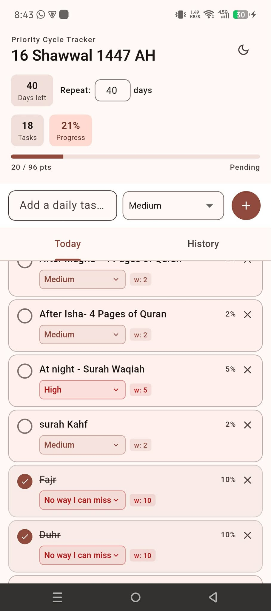
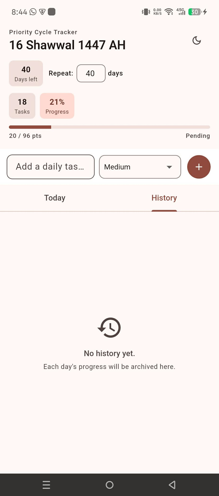
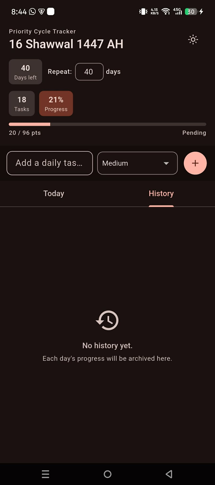

<div align="center">


<br /><br />

# Your Day — Priority Cycle Tracker

**A minimal, weighted daily task tracker built with Flutter.**  
Track your intentions across repeating cycles — anchored to the Islamic Hijri calendar.

<br />

[](https://github.com/Fahim715/Your-Day/releases/download/v1.0.0/app-release.apk)

> **First-time install on Android?**  
> Settings → Apps → Special app access → Install unknown apps → your browser → **Allow**

<br />

</div>

---

## Screenshots

| Today's Tasks | Bright Theme | Dark Theme |
|:---:|:---:|:---:|
|  |  |  |

> Light theme also supported — toggleable from the header.

---

## What It Does

**Your Day** lets you define a personal set of daily tasks, assign them priority weights, and track completion across a configurable repeat cycle (e.g. 40 days). Progress is weighted — not just a raw count — so high-priority tasks carry more significance.

| Feature | Detail |
|---|---|
| **Weighted priorities** | Low · Medium · High · *No way I can miss* → 1 / 2 / 5 / 10 pts |
| **Weighted progress bar** | 100% split proportionally across all task weights |
| **Hijri calendar** | Day counter anchored to the Islamic date |
| **Repeat cycles** | Configurable cycle length; tasks reset each cycle |
| **Daily archiving** | Each day's result is automatically saved to History |
| **Dark / Light theme** | System-aware toggle in the app header |
| **Fully offline** | No accounts, no network — everything stays on device |

---

## How to Use

1. **Add a task** — type in the input field, select a priority from the dropdown, tap **+**
2. **Set your cycle** — use the **Repeat** field to choose how many days the task list runs before resetting
3. **Check off tasks** — tap the checkbox next to a task; the weighted progress bar updates instantly
4. **Confirm the day** — tap **Confirm** to lock in priority weights for that day
5. **Review history** — switch to the **History** tab to see archived days and their final progress scores

> The date label uses the Islamic (Hijri) calendar and updates automatically based on your device timezone.

---

## Tech Stack

| Layer | Choice | Why |
|---|---|---|
| **Framework** | Flutter 3 (Dart) | Single codebase, native performance on Android |
| **Local storage** | `shared_preferences` | Lightweight key-value persistence for tasks & history |
| **Islamic calendar** | `hijri` package | Accurate Hijri date conversion without a server |
| **State** | `setState` / built-in Flutter | Kept intentionally simple — no external state manager needed |
| **CI/CD** | GitHub Actions | Auto-builds release APK on every push to `main` |

The app is intentionally dependency-light. No Firebase, no backend, no tracking.

---

## How CI/CD Works

Every push to `main` triggers a GitHub Actions workflow:

1. Provisions Ubuntu runner with **Flutter + Java 17**
2. Runs `flutter build apk --release`
3. Publishes the APK to **GitHub Releases** as `YourDay.apk`

The download badge above always resolves to the latest build.

---

## Run Locally

**Requirements:** Flutter SDK ≥ 3.0 · Android Studio · Java 17

```bash
git clone https://github.com/YOUR_USERNAME/YOUR_REPO.git
cd YOUR_REPO
flutter pub get
flutter run
```

**Build release APK manually:**

```bash
flutter build apk --release
# → build/app/outputs/flutter-apk/app-release.apk
```

---

<div align="center">

Built for personal use. Runs offline. No data leaves your device.

</div>
