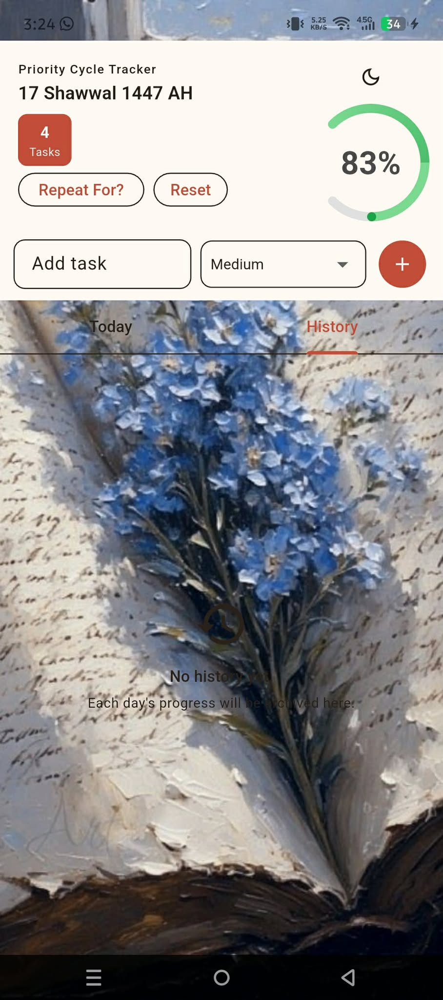

<div align="center">


<br /><br />

# Your Day

**A minimal daily task tracker that rewards consistency over completion.**  
Build habits across repeating cycles with a priority-weighted progress system.

<br />


<br /><br />

[](https://github.com/Fahim715/Your-Day/releases/download/v1.1.0/app-release.apk)

> **First-time install?** On Android: Settings → Apps → Special app access → Install unknown apps → allow your browser

</div>

---

## Screenshots

| Today's Tasks | Dark Theme | Bright Theme |
|:---:|:---:|:---:|
|  |  |  |

---

## Features

| | |
|---|---|
| **Weighted priorities** | Low · Medium · High · *No way I can miss* → 1 / 2 / 5 / 10 pts |
| **Progress bar** | Visual progress — turns green at 80%+ completion |
| **Repeat cycles** | Set how many days your task list runs before resetting |
| **Daily archiving** | Each day's result is saved automatically to History |
| **Reset controls** | Reset progress only, or reset everything with confirmation |
| **Dark / Light theme** | Toggle from the header |
| **Fully offline** | No accounts, no network — everything stays on device |

---

## How to Use

1. **Add tasks** — type a task name, pick a priority, tap **+**
2. **Set a cycle** — tap **Repeat For?**, enter the number of days, tap **Confirm**
3. **Track daily** — check off tasks; the progress bar updates in real time
4. **Review history** — open the **History** tab to see past days and scores

---

## Tech Stack

| Layer | Choice |
|---|---|
| Framework | Flutter 3 (Dart) |
| Storage | `shared_preferences` |
| State management | Built-in `setState` |
| CI/CD | GitHub Actions — builds and publishes APK on every push to `main` |

No Firebase. No backend. No tracking.

---

## Run Locally

```bash
git clone https://github.com/Fahim715/Your-Day.git
cd Your-Day
flutter pub get
flutter run
```

```bash
# Build release APK
flutter build apk --release
```

---

<div align="center">
Runs fully offline. No data ever leaves your device.
</div>
